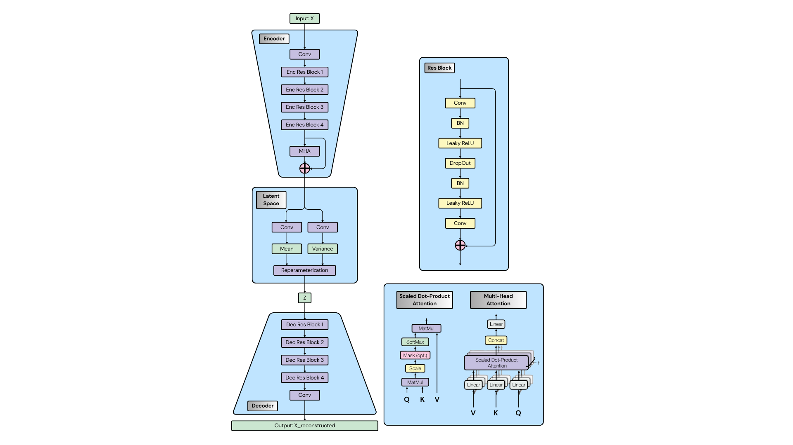
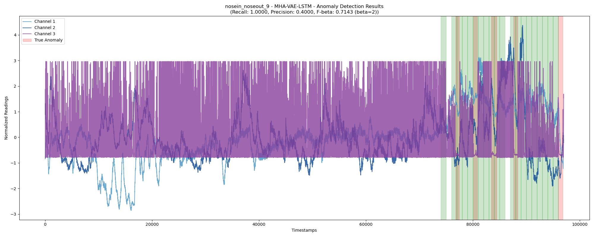

# MHA-VAE-LSTM for Respiratory Anomaly Detection

This repository contains the implementation of a Multi-Head Attention (MHA) enhanced Variational Autoencoder (VAE) with LSTM for respiratory anomaly detection. The model combines the strengths of VAE for feature extraction, LSTM for temporal pattern recognition, and multi-head attention for capturing complex relationships in respiratory data.

## Model Architecture



The MHA-VAE-LSTM model enhances the traditional VAE-LSTM with:
- **VAE Component**: Feature extraction and dimensionality reduction
- **LSTM Component**: Temporal pattern recognition
- **Multi-Head Attention**: Enhanced feature relationships capture
- **Modality Integration**: Weighted fusion of multiple sensor inputs

## Performance Comparison



The above figure shows the anomaly detection performance comparison between different models, demonstrating the enhanced capabilities of the MHA-VAE-LSTM architecture.

## Repository Structure

```
├── models.py                    # Core model architecture implementation
├── trainers.py                  # Training and evaluation logic
├── data_loader.py              # Custom data loading and preprocessing
├── grid_search.py              # Hyperparameter optimization
├── mha_vae_lstm_main.py        # Main training and inference script
├── utils.py                    # Utility functions
├── collected_data_preprocess.py # Data preprocessing for collected datasets
├── mha_vae_lstm_config.json    # Model configuration
├── dataset_config.json         # Dataset configuration
├── collected_data_run_script.sh # Shell script for workflow automation
├── experiments/                # Training logs and model checkpoints
└── datasets/                   # Processed datasets
```

## Features

### 1. Model Architecture
- **VAE Component**: Feature extraction and dimensionality reduction
- **LSTM Component**: Temporal pattern recognition
- **Multi-Head Attention**: Enhanced feature relationships capture
- **Modality Integration**: Weighted fusion of multiple sensor inputs

### 2. Training Pipeline
- **Two-Phase Training**:
  - VAE pre-training for feature extraction
  - LSTM training for temporal pattern recognition
- **Hyperparameter Optimization**:
  - Grid search for optimal model parameters
  - Automated hyperparameter tuning
- **Early Stopping**: Prevents overfitting with patience-based stopping

### 3. Data Processing
- **Custom Data Loader**: Handles multi-modal sensor data
- **Preprocessing Pipeline**:
  - Data normalization
  - Sliding window segmentation
  - Anomaly interval configuration
- **Dataset Configuration**: Flexible dataset setup through JSON config

### 4. Anomaly Detection
- **Adaptive Thresholding**: Dynamic threshold calculation
- **Multi-modal Integration**: Weighted fusion of different sensor modalities
- **Performance Metrics**: F-beta score optimization

## Configuration

### Model Configuration (`mha_vae_lstm_config.json`)
- Training parameters (epochs, learning rates, batch sizes)
- Model architecture parameters (hidden units, layers, dropout)
- Anomaly detection thresholds
- Modality weights for sensor fusion

### Dataset Configuration (`dataset_config.json`)
- Dataset paths and splits
- Anomaly interval indices
- Data preprocessing parameters

## Usage

1. **Data Preparation**:
   ```bash
   python collected_data_preprocess.py
   ```

2. **Model Training**:
   ```bash
   # For single training run
   python mha_vae_lstm_main.py

   # For hyperparameter grid search
   python grid_search.py
   ```

3. **Automated Workflow (Data Preprocessing + Single Model Training)**:
   ```bash
   ./collected_data_run_script.sh
   ```

## Key Parameters

### VAE Training
- Learning rate: 0.001
- Weight decay: 0.0001
- Hidden units: 256
- Code size: 20
- Patience: 200

### LSTM Training
- Learning rate: 0.001
- Batch size: 80
- Hidden units: 128
- Layers: 3
- Dropout: 0.1
- Patience: 15

### Anomaly Detection
- Threshold percentile: 80
- Prediction error deviation ratio: 0.8
- F-beta score: 2

## Output

The training process generates:
- Model checkpoints in `experiments/`
- Training logs and metrics
- Visualization plots for model performance
- Anomaly detection results

## Notes

- Ensure proper GPU configuration for training
- Adjust batch sizes based on available memory
- Monitor training progress through visualization intervals
- Use appropriate anomaly thresholds for your specific use case
