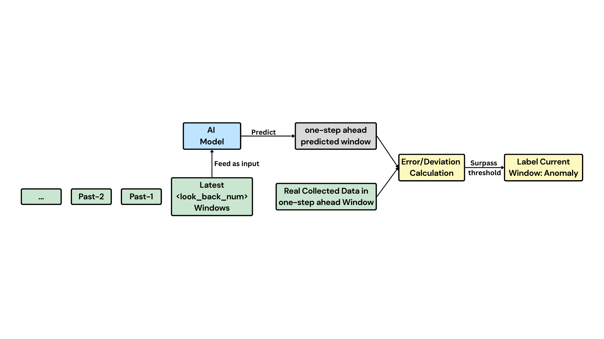

# Edge AI for healthcare applications (Respiratory Anomaly Detection)

This repo is for ***2024-2025 HKUST ECE Final Year Project***

* `Group Members`   PENG Yiyan, KUO Chen-chieh, FU Penglin
* `Supervisor`      Prof. ZHANG Jun
* `Project ID`      ZJ01b-24
* `Main Update Time` 2025-05-21

> [!IMPORTANT]
> **Healthcare Research Disclaimer**: This project was developed for academic research purposes and has only been tested in controlled academic environments. The respiratory anomaly detection models and systems presented here have **NOT been validated for clinical use**. Any healthcare applications require proper clinical validation, regulatory approval, and medical supervision.

> [!NOTE]
> This repo is now is well-organized, with FYP finished. All the models (pure-LSTM, VAE-LSTM, MHA-VAE-LSTM) & GUI have been implemented.
> 
> For the details of each model, please refer to the `README.md` in each model folder.
>
> This repo is now open-source under the MIT License.

## Repo Overview

Four branches in total (each branch shows the contribution of each group member):

* `main` for general purpose publish
* `hardware` regulated by KUO Chen-chieh
* `model_design` regulated by PENG Yiyan
* `model_compression` regulated by FU Penglin

## Project Overview

This repository contains the implementation of various deep learning models for respiratory anomaly detection, focusing on real-time detection capabilities. The project uses sensor data (temperature, humidity, audio) to detect anomalies in respiratory patterns.

## System Architecture

### Overall System Diagram


### Hardware System Setup


## Workflow

### Dataset Construction


### Anomaly Detection Process


## Repository Structure

```
├── real_time_demo/                     # Real-time detection implementation with GUI
│   ├── VAE_LSTM_real_time_detection_with_ui.py
│   ├── VAE_LSTM_data_loader.py
│   ├── VAE_LSTM_models.py
│   └── checkpoint_models/
├── VAE-LSTM-anomaly-detection/         # VAE-LSTM model implementation
├── MHA_VAE_LSTM_anomaly_detection/     # Multi-head attention VAE-LSTM implementation
├── pure_LSTM_anomaly_detection/        # Pure LSTM model implementation
├── Common_datasets/                    # Shared datasets for general model training
└── hardware_ypengbb/                   # Hardware interface and sensor integration
```

## Key Features

### 1. Model Implementations

- **Pure LSTM Model**
  - Basic LSTM architecture for respiratory pattern analysis
  - Suitable for simple anomaly detection tasks
  - Located in `pure_LSTM_anomaly_detection/`

- **VAE-LSTM Model**
  - Combines Variational Autoencoder with LSTM
  - Enhanced feature extraction and anomaly detection
  - Implementation in `VAE-LSTM-anomaly–detection/`

- **MHA-VAE-LSTM Model**
  - Advanced architecture with Multi-head Attention mechanism
  - Improved temporal pattern recognition
  - Located in `MHA_VAE_LSTM_anomaly_detection/`

### 2. Real-time Detection System

- **GUI Interface**
  - User-friendly interface for real-time monitoring
  - Visual feedback for anomaly detection
  - Located in `real_time_demo/`

- **Hardware Integration**
  - Sensor data acquisition (temperature, humidity, audio)
  - Real-time data processing pipeline
  - Implementation in `hardware_ypengbb/`

### 3. Development Tools

- **Environment Configuration**
  - CUDA 12.1 compatible environment setup (`cuda121_environment.yml`)
  - HPC server configuration for training

- **Dataset Management**
  - Common datasets for model training and testing (general datasets for anomaly detection)
  - Located in `Common_datasets/`

## Key Reference Repos

`Informer baseline code repo` [https://github.com/zhouhaoyi/Informer2020]

`VAE-LSTM baseline code repo` [https://github.com/lin-shuyu/VAE-LSTM-for-anomaly-detection] (VAE-LSTM for anomaly detection (ICASSP'20))

## License

This project is licensed under the MIT License. You may view the full license text [here](https://github.com/666harrypeng/Edge-AI-for-healthcare-applications/blob/main/LICENSE).
