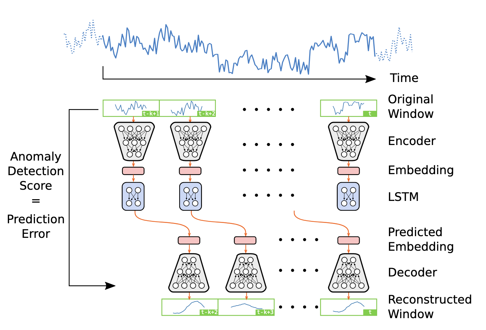

# VAE-LSTM for Respiratory Anomaly Detection

This repository contains the implementation of a Variational Autoencoder (VAE) combined with LSTM for respiratory anomaly detection. The implementation supports both the Numenta Anomaly Benchmark (NAB) datasets and project-custom collected respiratory datasets.

## Model Architecture



> Figure source: Lin, S., Clark, R., Birke, R., Schönborn, S., Trigoni, N., & Roberts, S. (2020). Anomaly detection for time series using VAE-LSTM hybrid model. In ICASSP 2020-2020 IEEE International Conference on Acoustics, Speech and Signal Processing (ICASSP) (pp. 4322-4326). IEEE.

The VAE-LSTM model combines:
- **VAE Component**:
  - Feature extraction and dimensionality reduction
  - Latent space representation learning
  - Configurable code size and hidden units
- **LSTM Component**:
  - Temporal pattern recognition
  - Sequence modeling
  - Configurable layers and hidden units

## Repository Structure

```
├── models.py                    # Core VAE-LSTM model architecture
├── trainers.py                  # Training and evaluation logic
├── data_loader.py              # Custom data loading and preprocessing
├── grid_search.py              # Hyperparameter optimization
├── vae_lstm_anomaly_detection_main.py  # Main training and inference script
├── utils.py                    # Utility functions
├── collected_data_preprocess.py # Preprocessing for project-custom datasets
├── preprocess_NAB_data.py      # Preprocessing for NAB datasets
├── vae_lstm_config.json        # Configuration for project-custom datasets
├── vae_lstm_config_NAB.json    # Configuration for NAB datasets
├── dataset_config.json         # Dataset configuration
├── collected_data_script.sh    # Shell script for workflow automation
├── environments.yml            # Environment configuration
├── experiments/                # Training logs and model checkpoints
└── datasets/                  # Processed datasets
    ├── NAB-known-anomaly/    # NAB benchmark datasets
    └── collected-known-anomaly/ # Project-custom respiratory datasets
```

## Features

### 1. Model Architecture
- **VAE Component**:
  - Feature extraction and dimensionality reduction
  - Latent space representation learning
  - Configurable code size and hidden units
- **LSTM Component**:
  - Temporal pattern recognition
  - Sequence modeling
  - Configurable layers and hidden units

### 2. Training Pipeline
- **Two-Phase Training**:
  - VAE pre-training for feature extraction
  - LSTM training for temporal pattern recognition
- **Hyperparameter Optimization**:
  - Grid search for optimal model parameters
  - Automated hyperparameter tuning
- **Early Stopping**: Prevents overfitting with patience-based stopping

### 3. Dataset Support

#### NAB Datasets
- **Preprocessing**: `preprocess_NAB_data.py`
- **Configuration**: `vae_lstm_config_NAB.json`
- **Features**:
  - Single-variable time series
  - Standard benchmark datasets
  - Known anomaly labels
- **Key Parameters**:
  - Learning rate: 0.000001 (VAE), 0.0001 (LSTM)
  - Batch size: 32 (VAE), 2 (LSTM)
  - Hidden units: 256
  - Code size: 8
  - Patience: 20

#### Project-Custom Respiratory Datasets
- **Preprocessing**: `collected_data_preprocess.py`
- **Configuration**: `vae_lstm_config.json`
- **Features**:
  - Multi-modal sensor data
  - Custom respiratory patterns
  - Project-specific anomaly intervals
- **Key Parameters**:
  - Learning rate: 0.001 (VAE), 0.001 (LSTM)
  - Batch size: 32
  - Hidden units: 256
  - Code size: 20
  - Patience: 200

## Usage

### For Project-Custom Datasets

1. **Data Preparation**:
   ```bash
   python collected_data_preprocess.py
   ```

2. **Model Training**:
   ```bash
   # For single training run
   python vae_lstm_anomaly_detection_main.py

   # For hyperparameter grid search
   python grid_search.py
   ```

3. **Automated Workflow**:
   ```bash
   ./collected_data_script.sh
   ```

### For NAB Datasets

1. **Data Preparation**:
   ```bash
   python preprocess_NAB_data.py
   ```

2. **Model Training**:
   ```bash
   # Update config to use NAB settings
   python vae_lstm_anomaly_detection_main.py
   ```

## Environment Setup

1. **Create Environment**:
   ```bash
   conda env create -f environments.yml
   ```

2. **Activate Environment**:
   ```bash
   conda activate vae_lstm_env
   ```

## Output

The training process generates:
- Model checkpoints in `experiments/`
- Best performing models in `well_trained/`
- Training logs and metrics
- Visualization plots for model performance
- Anomaly detection results

## Notes

- Ensure proper GPU configuration for training
- NAB datasets use single-variable input, while project-custom datasets support multi-modal input
- Adjust batch sizes based on available memory
- Monitor training progress through visualization intervals
- Use appropriate anomaly thresholds for your specific dataset type
- VAE training typically requires more epochs than LSTM training
- Consider using the grid search for optimal hyperparameter selection
